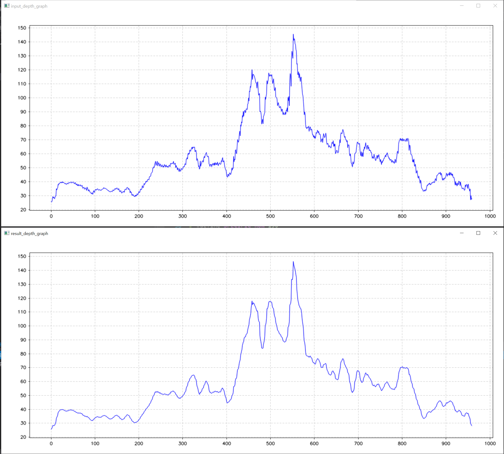
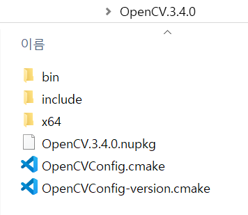

# EWMA
C++ implementation of Exponential Weighted Moving Average filter(https://dev.intelrealsense.com/docs/depth-post-processing)


### requirements

* opencv

  > for image read and write

* [CvPlot](https://github.com/Profactor/cv-plot)

  > for drawing graph (tested with [OpenCV3.4.14 release](https://opencv.org/releases/))
  
  * sample result(depth values at row=150)




### build

```cmake
cmake -G "Visual Studio 15 2017" -A x64 -B "build" -DCMAKE_PREFIX_PATH="YOUR_OPENCV_ROOT_DIR"
```
> example: cmake -G "Visual Studio 15 2017" -A x64 -B "build" -DCMAKE_PREFIX_PATH=C:/Users/yoonbae.jeon/OpenCV3.4.14/build


* windows

  > OpenCV root dir looks like this




### Run

```
ewma.exe [input data path]
```

- input data path -- optional
  - if not given, then _0.dat_ will be used

